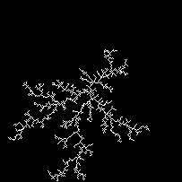
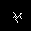

# DLA
DLA - Diffusion Limited Aggregation

Diffusion-limited aggregation (DLA) is the process whereby particles undergoing a random walk due to Brownian motion cluster together to form aggregates of such particles.
Proposed by T.A. Witten Jr. and L.M. Sander, DLA is applicable to aggregation in any system where diffusion is the primary mean of transport in the system.
The clusters formed due to DLA are known as Brownian trees.

## Installation

You will need:

- Python 3.6 (Anaconda Python recommended)
- PyTorch 
- torchvision
- pandas
- scipy
- tqdm
- tensorflow==1.13.1 
- numpy
- matplotlib
- imutils
- opencv-python
- tensorboardX
- seaborn
- sklearn

### PyTorch

On Linux:

```> conda install pytorch torchvision cudatoolkit=9.0 -c pytorch```

### OpenCV with Python bindings

On Linux, install using `conda`:

```> conda install opencv```

### The rest

Use pip like so:

```> pip install -r requirements.txt```

## Instructions to run simulations of DLA and generate dataset.

The main class of DLA object is present in `dla.py` as `Brownian_Tree`.

The file `DLA_run_main.py` is the main file used to run simulations.

The file `generate_trees_k.sh` consists of experiments to generate trees on a lattice of size 1001 with a padding size of 1 for locus mapping and different stickiness k=\[1.0, 0.5, 0.1, 0.05, 0.025, 0.0125, 0.00625, 0.003125, 0.0015625\]

The tensorboard log files and checkpoints are generated in the folder `runs`.
They can be visualized in tensorboard using `tensorboard --logdir runs/` command in the terminal.
Once the tensorboard is running, using `localhost:6006` all the plots, figures and datalogs can be viewed in tensorboard. 

- Tensorboard Scalars Tab :  
- Tensorboard Images Tab :  

The jupyter notebook `DLA_predict_stickiness_k.ipynb` includes precessing of the datasets (*.csv files) logged in the simulation part.
The processed dataset is then used to fit a polynomial used for predicting the stickiness.
The file includes some of the samples images so that the model can be quickly trained and validated for it's correctness.

## Brownian Tree Formation
- Start with an empty lattice with only one seed particle at the center which is stuck.
- Start diffusing particles, one at a time, randomly along a given locus. The locus can be along the edges of a square or circumference of the circle etc.
\item The diffused particle is allowed to undergo random walk ( Brownian motion ) until it encounters a neighbouring particle which is stuck and hence the current particle sticks as well.
- This process is continued until the diffusion locus is exhausted by the tree growth.

## Factors affecting the formation of Brownian trees
- Lattice Structure : The lattice selected for tree formation. e.g. square lattice or circular lattice etc.
- Seed Particle Location : The location of the seed particle causes the change in the tree formation. e.g. at the center, on the corners, on the edge etc.
- Diffusion Locus : The diffusion locus used for particle diffusion. e.g. locus along the edges of a square lattice or along the circumference of a circular lattice etc.
- Stickiness (k) : The probability with which a particle is stuck on reaching a stuck neighbour. e.g. k=1 i.e. always sticks or k=0.5 i.e. sticks only with a probability of 0.5 etc.
- Boundary Condition on the particles : The behavior of the particle on reaching the end of the lattice. e.g. if the particles reaches the end of lattice, terminate and continue with a new random particle or bounce back into the lattice with an inverted velocity or reintroduce the same particle in a toroidally bound manner etc.

## Illustrations of Brownian trees formation
- run `sh generate_trees_k.sh` on terminal to start the DLA simulation and dataset creation.
- The data will be logged in `runs/part05_brownian_tree_generation` which can be easily visualized in tensorboard.

Screenshot of the part05_brownian_tree_generation from Tensorboard (page 1) : 
Screenshot of the part05_brownian_tree_generation from Tensorboard (page 2) : 

Note : All the illustrations below are directly taken from the tensorboard visualizations.

### Illustrations of fully grown Brownian trees using locus mapping method for faster tree growth.
- Max lattice size = 1001, k = 1.0, Pad size = 1, N=8131

 
- Max lattice size = 1001, k = 0.5, Pad size = 1, N=7416


- Max lattice size = 1001, k = 0.1, Pad size = 1, N=14046


- Max lattice size = 1001, k = 0.05, Pad size = 1, N=16016


- Max lattice size = 1001, k = 0.025, Pad size = 1, N=18122


- Max lattice size = 1001, k = 0.0125, Pad size = 1, N=24216


- Max lattice size = 1001, k = 0.00625, Pad size = 1, N=22022


- Max lattice size = 1001, k = 0.003125, Pad size = 1, N=14204


- Max lattice size = 1001, k = 0.0015625, Pad size = 1, N=14096


Due to the scale invariance property of Brownian trees, The structure in which tree the grow is the same as far as the stickiness is fixed.
The effect of stickiness (k) can be clearly observed above. Smaller stickiness results in more internal diffusion and dense cluster formation.

- Checkpoint images with lattice size 205 below.
- Max lattice size = 205, k = 1.0, Pad size = 1

 
- Max lattice size = 205, k = 0.5, Pad size = 1


- Max lattice size = 205, k = 0.1, Pad size = 1


- Max lattice size = 205, k = 0.05, Pad size = 1


- Max lattice size = 205, k = 0.025, Pad size = 1


- Max lattice size = 205, k = 0.0125, Pad size = 1


- Max lattice size = 205, k = 0.00625, Pad size = 1


- Max lattice size = 205, k = 0.003125, Pad size = 1


- Max lattice size = 205, k = 0.0015625, Pad size = 1


### Illustrations of effect of padding size used in locus mapping on random walk.
Note : `runs/part01_brownian_motion_of_particles` folder has all the data plots and tensorboard logs as the gifs below might not be clearly visible.
The same can be viewed in tensorboard very clearly.

Screenshot of the part01_brownian_motion_of_particles from Tensorboard : 

- Max lattice size = 21, k = 1.0, Pad size = 10. : 
- Max lattice size = 21, k = 1.0, Pad size = 9. :
- Max lattice size = 21, k = 1.0, Pad size = 8. : 
- Max lattice size = 21, k = 1.0, Pad size = 7. : 
- Max lattice size = 21, k = 1.0, Pad size = 6. : 
- Max lattice size = 21, k = 1.0, Pad size = 5. : 
- Max lattice size = 21, k = 1.0, Pad size = 4. : 
- Max lattice size = 21, k = 1.0, Pad size = 3. : 
- Max lattice size = 21, k = 1.0, Pad size = 2. : 
- Max lattice size = 21, k = 1.0, Pad size = 1. : 

Note : As the padding size increase the effective lattice area for random walk increases and hence the particle takes longer to aggregate even with a stickiness k=1.0

### Illustrations of effect of stickiness (k) in the generation of Brownian tree.
Note : `runs/part02_stickiness_of_particles` folder has all the data plots and tensorboard logs as the gifs below might not be clearly visible.
The same can be viewed in tensorboard very clearly.

Screenshot of the part02_stickiness_of_particles from Tensorboard : 

- Max lattice size = 11, k = 1.0 : 
- Max lattice size = 11, k = 0.5 : 
- Max lattice size = 11, k = 0.1 : 
- Max lattice size = 11, k = 0.05 : 
- Max lattice size = 11, k = 0.025 : 
- Max lattice size = 11, k = 0.0125 : 
- Max lattice size = 11, k = 0.00625 : 
- Max lattice size = 11, k = 0.003125 : 
- Max lattice size = 11, k = 0.0015625 : 

Note : As the stickiness k decreases, the particles are able to diffuse further into the lattice and hence forming a more dense clusters of tree.
Also the decrease in the diffusion locus location for introducing the particles can be observed due to toroidal structure until there is no diffusion locus left prompting termination.

### Illustrations of effect of Max lattice size in the generation of Brownian tree.
Note : `runs/part03_brownian_tree_generation` folder has all the data plots and tensorboard logs as the gifs below might not be clearly visible.
The same can be viewed in tensorboard very clearly.

Screenshot of the part03_brownian_tree_generation from Tensorboard : 

- Max lattice size = 3, k = 1.0, Pad size = 1.


- Max lattice size = 7, k = 1.0, Pad size = 1.


- Max lattice size = 15, k = 1.0, Pad size = 1.


- Max lattice size = 31, k = 1.0, Pad size = 1.


- Max lattice size = 63, k = 1.0, Pad size = 1.


- Max lattice size = 127, k = 1.0, Pad size = 1.


- Max lattice size = 255, k = 1.0, Pad size = 1.


Due to the scale invariance property of Brownian trees, The structure in which tree the grow is the same as far as the stickiness is fixed.

### Trick for faster Brownian tree generation.
Locus mapping for reducing the effective area of random walk.
Refer to **DLA_Sourabh_Balgi_report.pdf** for further explaination.

## Estimation of stickiness (k) from the simulation data

### Dataset creation
- run `sh generate_trees_k.sh` on terminal to start the DLA simulation and dataset creation.
- Create dataset from the DLA simulation during Brownian tree generation.
- Perform train, dev, test splits on the full dataset for using dev set to select best model complexity without over fitting on train set. Test set is used for evaluation on unseen data.
- Complete dataset is split into train (66%) and test (33%).
- Further the train is split into train (80%) and dev (20%) for selecting the best model without overfitting on the training data. 

### Feature analysis for estimation of stickiness (k)
- Contour perimeter : The effective perimeter of the tree available for aggregation.

- Contour area : The effective area enclosed by the perimeter of the tree.

- Rectangular bounding box area : The area of the minimum rectangular bounding box enclosing the tree.

- Radius of bounding circle : The radius of the minimum circle bounding enclosing the tree.

- Convex hull area : The area of the minimum convex hull enclosing the tree.

- Extent : Extent is defined as the ratio of contour area to bounding rectangle area.

- Solidity : Solidity is defined as the ratio of contour area to its convex hull area.

- Fractal Dimension : Fractal Dimension is estimated using the standard box counting method as this is an important statistical quantity of fractals. 


- legend for the feature plots above


- Correlation plots of the features. This indicates the correlation of the logged features.


### Model selection
- `DLA_predict_stickiness_k.ipynb` consists of the part of predicting the stickiness (k) by fitting the data from the simulation.
- Observing the features from before, The relation of stickiness (k) with number of particles (N) is clearly nonlinear. 
- The plot of contour perimeter against number of particles (N) with different values of k indicates that the slope of the curve is related to stickiness (k).
- However since the slope for different k are not equally spaced, this indicates that the slope is a nonlinear function of stickiness (k).
- We fit curves of ratio of contour perimeter to number of particles against log(k) with different degrees of model complexity. 
- We select the best model with the least MAE (Mean Absolute Error) and MSE (Mean Squared Error) on the dev set to avoid and overfitting on train set. 

- For k=\[0.001, 0.05\] range, the best model complexity was observed as a polynomial of degree 2. ![MAE and MSE plots on dev and test set against differnt model complexity for k=\[0.001, 0.05\]](images/git_imgs/k_005_0001.png)

- For k=\[0.001, 1.0\] range, the best model complexity was observed as a polynomial of degree 4. ![MAE and MSE plots on dev and test set against differnt model complexity for k=\[0.001, 1.0\]](images/git_imgs/k_10_0001.png)

### Results and Conclusion

The MAE and MSE for the best models are reported as below.


### Future Work

- Question : **Are we there yet in predicting the stickiness (k) accurately?!** Answer : Definetely not !!! 
- We can do even better by carefully analysing all the other features and fitting better models such as linear regression with L1/L2 regularizers or SVR (Support Vector Regressor) with RBF kernel.
